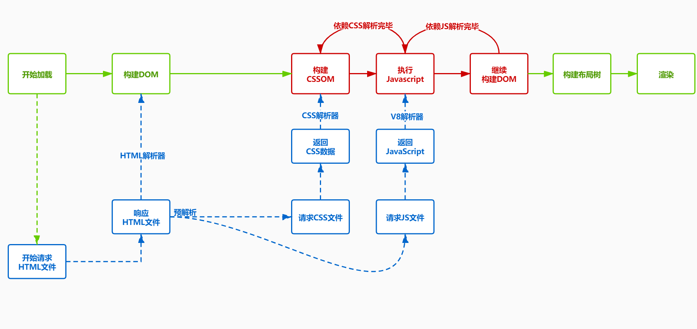

### 总结：DOM如何生成的

*   当服务端返回的类型是`text/html`时，浏览器会将收到的数据通过`HTMLParser`进行解析 (边下载边解析)

*   在解析前会执行预解析操作，会预先加载`JS`、`CSS`等文件

*   字节流 -> 分词器 -> Tokens -> 根据token生成节点 -> 插入到 DOM树中

*   遇到`js`:在解析过程中遇到`script`标签，`HTMLParser`会停止解析，（下载）执行对应的脚本。

*   在`js`执行前，需要等待当前脚本之上的所有`CSS`加载解析完毕（`js`是依赖`css`的加载）

*   `CSS`样式文件尽量放在页面头部，`CSS`加载不会阻塞DOM tree解析,浏览器会用解析出的`DOM TREE`和 `CSSOM` 进行渲染，不会出现闪烁问题。如果`CSS`放在底部，浏览是边解析边渲染，渲染出的结果不包含样式，后续会发生重绘操作。
*   `JS`文件放在HTML底部，防止`JS`的加载、解析、执行堵塞页面后续的正常渲染

> 通过`PerformanceAPI` 监控渲染流程