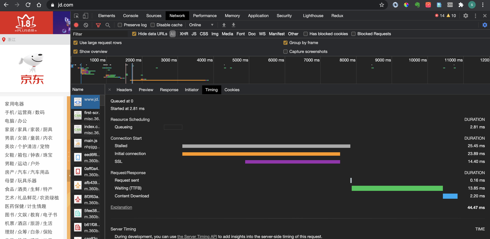
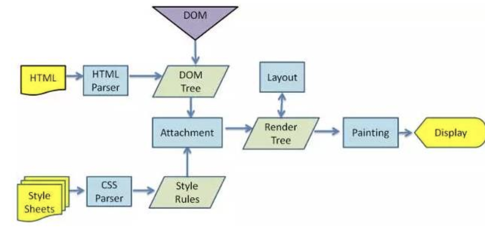

## 从输入URL到浏览器显示页面发生了什么?

用户输入的是关键字还是URL？ 如果是关键字则使用默认搜索引擎生产URL

### 1.浏览器进程的相互调用

*   在浏览器进程中输入`url`地址开始导航。并准备渲染进程
*   在网络进程中发送请求，将响应后的结果交给渲染进程处理
*   解析页面，加载页面中所需资源
*   渲染完毕，展示结果

> 我们开始细化每一步流程，并且从流程中提取我们可以优化的点。

### 2.`URL`请求过程

- 网络七层模型 (物理层 数) 网(ip) 传 (tcp 安全可靠 分段传输,udp 丢包) （会 表 应） http

*   浏览器查找当前URL是否存在缓存，如果有缓存、并且缓存未过期，直接从缓存中返回。(浏览器访问完会自己存到自己的硬盘或者内存中，可以走内存缓存也可以走磁盘缓存)

*   查看域名是否已经被解析过了，没有解析过进行`DNS`解析将域名解析成`IP`地址，并增加端口号
    - 域名只是为了方便我们记忆，真正找到还是需要ip地址,因此DNS 解析就是这样的作用，将域名解析成ip地址
    - DNS主要做了一个映射表，把域名和ip相映射，像一个大型分布式数据库
    - DNS 基于UDP, 为什么基于udp，查找过程中涉及服务器查找，涉及一级域名二级域名，如果是tcp，每次经过一个域名就需要三次握手，udp就不会，就比较快，发个包就确认了，查一个域名如果丢包了就重发就好了

*   如果请求是`HTTPS`，进行`SSL`协商（确保数据安全性）

*   利用`IP`地址进行寻址查找对方，请求排队。同一个域名下请求数量不能多余6个。
    - 为什么要排队等待，因为一个域名下可能有多个请求，同一个域名在http1.1中有限制，最多建立6个http连接，最多能发送6个http请求。

*   排队后服务器创建`TCP`链接，用于传输 （三次握手）

*   利用`TCP`协议将大文件拆分成数据包进行传输(有序传输)，可靠的传输给服务器（丢包重传），服务器收到后按照序号重排数据包 （增加`TCP`头部，`IP`头部）

*   发送数据，主要依赖HTTP请求。发送HTTP请求（请求行，请求头，请求体）

*   HTTP1.1发送过程中默认不会断开。`HTTP 1.1`中支持`keep-alive`属性,TCP链接不会立即关闭，后续请求可以省去建立链接时间。

*   服务器响应结果（响应行，响应头，响应体）

*   服务器可以设置状态码，返回状态码为301、302时，浏览器会进行重定向操作。（重新进行导航，就会重新走上面的流程）

*   返回304则查找缓存。（服务端可以设置强制缓存）

通过`network Timing` 观察请求发出的流程：

*   `Queuing`: 请求发送前会根据优先级进行排队，同时每个域名最多处理6个TCP链接，超过的也会进行排队，并且分配磁盘空间时也会消耗一定时间。

*   `Stalled` :请求发出前的等待时间（处理代理，链接复用）

*   `DNS lookup` :查找`DNS`的时间

*   `initial Connection` :建立TCP链接时间

*   `SSL`: `SSL`握手时间（`SSL`协商）

*   `Request Sent` :请求发送时间（可忽略）

*   `Waiting`(`TTFB`) :等待响应的时间，等待返回首个字符的时间

*   `Content Dowloaded` :用于下载响应的时间

> 蓝色：`DOMContentLoaded`:`DOM`构建完成的时间
> 
> 红色：`Load`:浏览器所有资源加载完毕

> 本质上，浏览器是方便一般互联网用户通过界面解析和发送HTTP协议的软件

### 解析一个网站的流程
访问一个京东网站
jd.com

先找不到 302 重定向到www.jd.com
又重定向302， 到https://www.jd.com
访问完后，进行请求
很多请求是并发的，同一时间最多建立6个连接

timing:
1.排队 1.16s 先排队 有的优先级高 Priority 优先高的先发送

Connection Start
stalled 连接开始 先做连接复用，可能处理代理相关的逻辑 也有等待时间

dns lookup  dns查询 域名解析成地址的时间

initial connection 开始创建连接 tcp建立的时长
ssl ssl协商

Request/Response 
request sent 请求发送时间
waiting 请求发出去 到响应时间 到服务器返回字节（主要优化）
content download 请求下载时间 文件下载过程（gzip）

### 3.`HTTP`发展历程

*   HTTP/0.9 在传输过程中没有请求头和请求体，服务器响应没有返回头信息，内容采用ASCII字符流来进行传输 HTML
    - 返回的字符串 所以只能进行文本传输

*   HTTP/1.0 增加了请求头和响应头，实现多类型数据传输
    - 根据headers 进行不同类型的资源处理

*   HTTP/1.1 默认开启持久链接，在一个TCP链接上可以传输多个HTTP请求 ， 采用管线化的方式（每个域名最多维护6个TCP持久链接）解决**队头阻塞**问题 （服务端需要按顺序依次处理请求）。完美支持数据分块传输（`chunk transfer`），并引入客户端cookie机制、安全机制等。

*   HTTP/2.0 解决网络带宽使用率低 （TCP慢启动，多个TCP竞争带宽，队头阻塞）采用多路复用机制（一个域名使用一个TCP长链接，通过二进制分帧层来实现）。头部压缩（`HPACK`）、及服务端推送
    - http2.0的headers 很多都是冒号开头 ：method 等等，冒号开头的会对应给他们做一个映射表，可以进行头部压缩，用`HPACK`

*   HTTP/3.0 解决TCP队头阻塞问题， 采用`QUIC`协议。`QUIC`协议是基于`UDP`的 （目前：支持和部署是最大的问题）

*   HTTP明文传输,在传输过程中会经历路由器、运营商等环节，数据有可能被窃取或篡改 （**安全问题**）

> 对比HTTP/1.1 和 HTTP/2 的差异

### 4.渲染流程

*   1.浏览器无法直接使用HTML，需要将HTML转化成DOM树。（`document`）
*   2.浏览器无法解析纯文本的`CSS`样式，需要对`CSS`进行解析,解析成`styleSheets`。`CSSOM`（`document.styleSeets`）
*   3.计算出DOM树中每个节点的具体样式（Attachment）
*   4.创建渲染（布局）树，将DOM树中可见节点，添加到布局树中。并计算节点渲染到页面的坐标位置。（layout）
*   5.通过布局树，进行分层 （根据定位属性、透明属性、transform属性、clip属性等）生产图层树
*   6.将不同图层进行绘制，转交给合成线程处理。最终生产页面，并显示到浏览器上 (Painting,Display)

> 查看layer并对图层进行绘制的列表